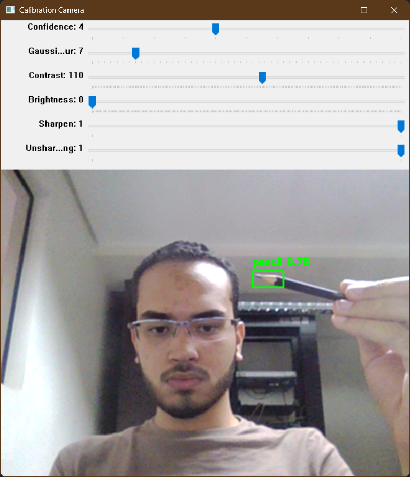

# Augmented Reality Board

## [English Version](README_EN.md)

## Descrição

Este projeto é uma lousa virtual de realidade aumentada, onde o usuário pode desenhar na tela utilizando a webcam. O projeto foi desenvolvido utilizando principalmente o algoritmo de detecção de objetos em tempo real [YOLOv5](https://github.com/ultralytics/yolov5) e as bibliotecas [OpenCV](https://opencv.org/releases/) e [PyTorch](https://pytorch.org/) para [Python 3.12](https://www.python.org/).


A rede neural YOLOv5 foi treinada utilizando um [dataset próprio](https://universe.roboflow.com/victorpl/ar-board), anotado manualmente na plataforma [Roboflow](https://roboflow.com/). A versão mais recente do dataset, utilizada para treinar o modelo no repositório contém 5760 imagens de um lápis, um canetão azul e um apagador, utilizados para desenhar na tela.

Os parâmetros de treinamento utilizados para treinar o modelo em uma máquina com GPU Nvidia GeForce RTX 4070 foram:

```py
python train.py --img 640 --batch -1 --epochs 200 --data dataset.yaml --weights yolov5m.pt --cache
```

Um notebook que pode ser utilizado para treinar o modelo em nuvem a partir de um dataset do Roboflow é disponibilizado pela própria plataforma no Google Colab, [aqui](https://colab.research.google.com/drive/1gDZ2xcTOgR39tGGs-EZ6i3RTs16wmzZQ)

## Utilização

### Pré-requisitos

- Computador com webcam
- Última versão do [Python 3.12](https://www.python.org/downloads/)
- [PyTorch](https://pytorch.org/get-started/locally/) para Python (escolha uma das versões com CUDA se tiver uma GPU Nvidia)
  - Caso tenha uma GPU Nvidia, instale antes a última versão do [CUDA Toolkit](https://developer.nvidia.com/cuda-toolkit-archive) compatível com a versão do PyTorch (atualmente, 12.4).
  - Também é necessário instalar o [cuDNN](https://developer.nvidia.com/cudnn) compatível com a versão do CUDA Toolkit.

### Instalação

1. Clone o repositório (ou faça o download do código fonte) e entre na pasta do projeto:

    ```bash
    git clone https://github.com/VictorPLopes/AR-Board.git
    ```

    ```bash
    cd AR-Board
    ```

2. Instale as dependências do projeto:

    ```bash
    pip install -r requirements.txt
    ```

3. Execute o scrpit `calibration_camera.py` para calibrar a câmera:

    ```bash
    python calibration_camera.py
    ```

    - Ajuste os parâmetros na tela até que os objetos sejam detectados corretamente. Pressione a tecla `esc` para salvar os parâmetros e fechar a janela.

    

### Execução

Para executar o projeto, basta rodar o script `main.py`:

```bash
python main.py
```

- Para desenhar na tela com a cor cinza, segure o lápis e mova-o na frente da webcam.
- Para desenhar na tela com a cor azul, segure o canetão azul e mova-o na frente da webcam.
- Para apagar o desenho, segure o apagador e mova-o na frente da webcam sobre a área que deseja apagar.

É possível ajustar os parâmetros da imagem durante a execução do programa. Estes são compartilhados com a calibração da câmera.

Para sair do programa, pressione a tecla `esc`.

## Autores

- Allan Bastos da Silva
- Mateus Carvalho Lucas
- Victor Probio Lopes
- Wilson Bin Rong Luo
