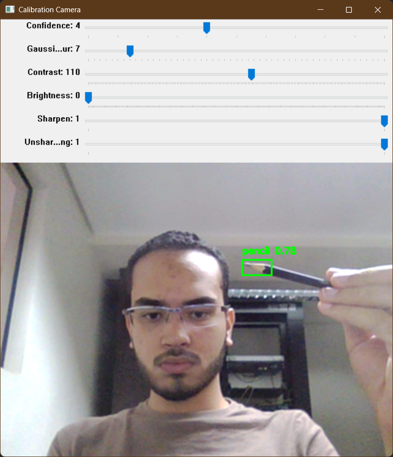

# Augmented Reality Board

## [Versão em Português](README.md)

## Description

This project is a virtual augmented reality board where the user can draw on the screen using the webcam. The project was developed primarily using the real-time object detection algorithm [YOLOv5](https://github.com/ultralytics/yolov5) and the libraries [OpenCV](https://opencv.org/releases/) and [PyTorch](https://pytorch.org/) for [Python 3.12](https://www.python.org/). This work was created for the Digital Image Processing course in the Computer Engineering program at IFSP Piracicaba.


The YOLOv5 neural network was trained using a [custom dataset](https://universe.roboflow.com/victorpl/ar-board), manually annotated on the [Roboflow](https://roboflow.com/) platform. The latest version of the dataset, used to train the model in this repository, contains 5760 images of a pencil, a blue marker, and an eraser, which are used to draw on the screen.

The training parameters used to train the model on a machine with an Nvidia GeForce RTX 4070 GPU were:

```py
python train.py --img 640 --batch -1 --epochs 75 --data dataset.yaml --weights yolov5m.pt --cache
```

A notebook that can be used to train the model in the cloud using a dataset from Roboflow is provided by the platform itself on Google Colab, [here](https://colab.research.google.com/drive/1gDZ2xcTOgR39tGGs-EZ6i3RTs16wmzZQ).

## Usage

### Prerequisites

- A computer with a webcam
- Latest version of [Python 3.12](https://www.python.org/downloads/)
- [PyTorch](https://pytorch.org/get-started/locally/) for Python (choose a CUDA-enabled version if you have an Nvidia GPU)
  - If you have an Nvidia GPU, first install the latest version of the [CUDA Toolkit](https://developer.nvidia.com/cuda-toolkit-archive) compatible with the PyTorch version (currently, 12.4).
  - You also need to install [cuDNN](https://developer.nvidia.com/cudnn) compatible with the CUDA Toolkit version.

### Installation

1. Clone the repository (or download the source code) and navigate to the project folder:

    ```bash
    git clone https://github.com/VictorPLopes/AR-Board.git
    ```

    ```bash
    cd AR-Board
    ```

2. Install the project dependencies:

    ```bash
    pip install -r requirements.txt
    ```

3. Run the `calibration_camera.py` script to calibrate the camera:

    ```bash
    python calibration_camera.py
    ```

    - Adjust the on-screen parameters until the objects are correctly detected. Press the `esc` key to save the parameters and close the window.

    

### Execution

To run the project, simply execute the `main.py` script:

```bash
python main.py
```

- To draw on the screen with the gray color, hold the pencil and move it in front of the webcam.
- To draw on the screen with the blue color, hold the blue marker and move it in front of the webcam.
- To erase the drawing, hold the eraser and move it in front of the webcam over the area you want to erase.

You can adjust image parameters during the program execution. These are shared with the camera calibration.

To exit the program, press the `esc` key.

## Authors

- Allan Bastos da Silva
- Mateus Carvalho Lucas
- Victor Probio Lopes
- Wilson Bin Rong Luo
